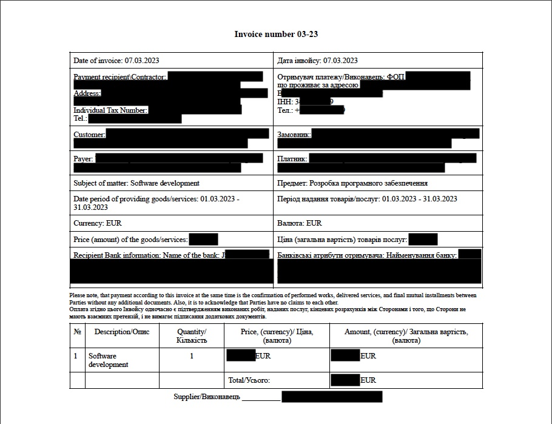

Installation:  
`npm install`

Usage:
1. Make a copy of a file sampleData.json and rename it to data.json. This file will contain all of your private data.
2. Run `npm start`
3. Your invoice will be stored in "invoices" folder

Example:  
